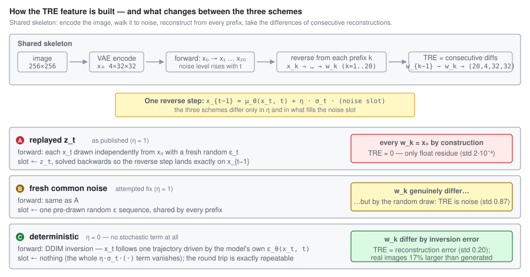
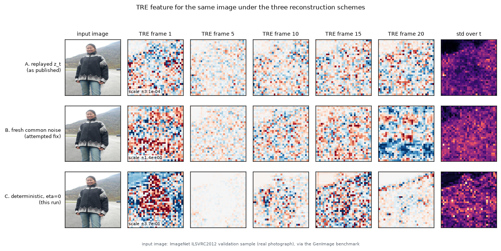

# TRE Diffusion Image Detection

Detecting AI-generated images from the **Temporal Reconstruction Error (TRE)**
of a diffusion model, classified by temporal / spatial attention.

This repository holds the code, the **full-scale re-run of the experiment**, and
the analysis of what the method actually measures. The headline finding is
negative and is the point of the repository: as formulated, the TRE feature
carries no usable signal, and we show why.

## Results

GenImage. Train: SDv1.4, 30k fake + 30k real (seed 42), 20 epochs. Evaluation:
all 8 generators, full test splits (12k each, 16k for sdv5). Identical
classifier and hyperparameters in both conditions — the only difference is how
the reconstruction is driven.

| Condition | Train acc | Held-out val acc | **Mean acc (8 generators)** |
| --- | --- | --- | --- |
| **A. Replayed noise** (as originally formulated) | 78.7% | 63.5% | **57.7%** |
| **B. Fresh common noise** (attempted fix) | 96.3% | 50.7% | **50.1%** |

Per generator, raw numbers in [`results/repro.json`](results/repro.json) and
[`results/fresh.json`](results/fresh.json):

| | sdv4 (in-domain) | sdv5 | adm | biggan | glide | midjourney | vqdm | wukong | **mean** |
| --- | --- | --- | --- | --- | --- | --- | --- | --- | --- |
| A: replayed — acc | 61.5 | 62.2 | 54.4 | 54.7 | 58.1 | 55.0 | 56.2 | 59.8 | **57.7** |
| A: replayed — AP | .642 | .648 | .541 | .560 | .593 | .552 | .562 | .623 | — |
| B: fresh — acc | 50.1 | 50.7 | 49.9 | 49.3 | 50.5 | 50.1 | 50.4 | 50.1 | **50.1** |
| B: fresh — AP | .503 | .504 | .499 | .490 | .504 | .499 | .503 | .505 | — |

**Condition A barely beats chance even in-domain (61.5%)** and drops to 54-60%
on unseen generators. **Condition B is exactly chance everywhere** while fitting
the training set to 96%.

## Why: the feature collapses either way

All three schemes share one skeleton — encode, walk the latent to noise,
reconstruct from every prefix, take the differences of consecutive
reconstructions. They differ only in the stochasticity coefficient `η` and in
what fills the noise slot of a reverse step:



The same input image, put through all three: the feature is a float-level
residue in A, pure noise in B, and structured reconstruction error in C.



*Input image: ImageNet ILSVRC2012 validation sample (real photograph),
distributed as the `nature` split of the GenImage benchmark. Heatmaps show the
channel mean of the TRE tensor; note the per-row scale annotation — A's range is
~10⁻⁴ while B's is ~1.*

The pipeline uses *edit-friendly* DDPM inversion, which records, for every step,
the noise `z_t` that makes the reverse process land exactly on the pre-sampled
`x_{t-1}`. TRE is then defined as the difference between reconstructions started
from different prefixes of that noise sequence.

- **Replaying `z_t`** (condition A) makes every prefix reconstruct the *same*
  latent by construction, so the difference is mathematically zero. What remains
  is GPU floating-point non-determinism: measured `std ~ 2.7e-4` against a latent
  scale of ~1. The weak in-domain signal is that residue's image-dependent
  pattern, which is why it does not transfer across generators.
- **Injecting fresh noise** (condition B) makes prefixes genuinely differ, but
  the variance term `sigma_t * eps_t` dominates: prefixes of different length
  accumulate a different number of such terms, so the difference is driven by the
  image's random draw rather than by how well the model explains the image. The
  classifier memorises the draw (96% train) and transfers nothing.

Either way the stochastic reverse process destroys the quantity the method
intends to measure. Full derivation, measurements and follow-up directions:
[`docs/finding-tre-collapse.md`](docs/finding-tre-collapse.md) and
[`docs/ideas-generalization.md`](docs/ideas-generalization.md).

**In progress — scheme C (`η = 0`).** Removing the stochastic term entirely
leaves the prefix differences to reflect only DDIM inversion error, i.e. how
accurately the model can round-trip the image. First measurements on 16 images:
the feature magnitude rises ~500x over scheme A (std 0.20 vs 2·10⁻⁴) and real
photographs show a **17% larger** error than generated ones — the direction
DIRE/LaRE-style detectors rely on. The full-scale run is under way; numbers will
land in `results/eta0.json`.

Baseline numbers (STRE, NPR, DIRE, LaRE) are **not reproduced here**; cite them
from their original papers, noting protocol differences.

## Method / code layout

1. **Diffusion inversion** ([`src/data/inversion.py`](src/data/inversion.py)) —
   edit-friendly DDPM/DDIM inversion: `inversion_forward_process` records the
   noise sequence, `inversion_reverse_process` reconstructs from it.
2. **TRE features** ([`src/data/tre_features.py`](src/data/tre_features.py)) —
   `over_denosing()` reconstructs prefix by prefix and returns the `T` step-wise
   latent differences, a `(T=20, 4, 32, 32)` tensor per image.
3. **Classifiers** ([`src/models/`](src/models)) — `resnet_baseline.py` holds the
   temporal-MHSA x spatial-focusing -> ResNet18 detector used in both conditions;
   `dnsamnet.py` / `attention.py` / `temporal_attention.py` /
   `spatial_attention.py` hold the hand-written attention variant (DNSAMNet),
   which needs a different feature type (U-Net attention maps) and is untested.

```
├── src/                  # library: inversion, TRE features, datasets, models
├── experiments/          # the full-scale re-run harness (multi-GPU, orchestrated)
├── results/              # measured accuracy/AP per generator, both conditions
└── docs/                 # analysis of the collapse, follow-up ideas, project report
```

## Reproducing

Data is not included. Download GenImage from its
[official release](https://github.com/GenImage-Dataset/GenImage) (an HF mirror of
the same archives exists at `jzousz/GenImage`), then see
[`experiments/README.md`](experiments/README.md) for the exact pipeline:

```bash
python experiments/build_lists.py                       # train/test file lists
python experiments/extract_tre.py --list ... --out ...  # add --fresh for condition B
python experiments/train_eval.py --features ...         # train + per-generator eval
```

Feature extraction is the bottleneck: the prefix construction costs 250 UNet
calls per image (~0.83 img/s per L40S at batch 48), i.e. roughly 20 GPU-hours
per condition for the 160k images. Precomputed `.pt` features and trained
weights are not distributed.

Environment: Python 3.11, torch 2.3.1+cu121, torchvision 0.18.1,
diffusers 0.31.0, transformers 4.44.2, numpy<2. Features are computed in fp32
and stored as fp16 — condition A's signal lives at the 1e-4 level, so lowering
the compute precision destroys it.

## Fixed while re-running

Both bugs were latent because the original notebooks never completed a run:

- `AttentionClassifier` passed a 5-D `(B,T,C,H,W)` tensor to `SpatialFocusing`,
  which unpacks four dimensions — now the channel axis is averaged first.
- `build_dataset.py` wrote features to the wrong class directory: GenImage class
  dirs sort as `[ai, nature]`, so indexing `LABEL_MAP` by the numeric label put
  fakes under `real/` and vice versa — now mapped by class name.

Also: accuracy thresholding at `> 0` on a sigmoid output (always true) was
corrected to `> 0.5`; `SpatialFocusing` referenced an undefined `num_head`;
hard-coded machine paths moved to `src/config.py`.
